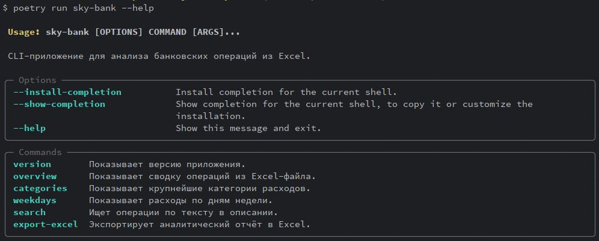
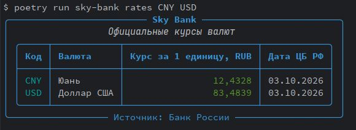
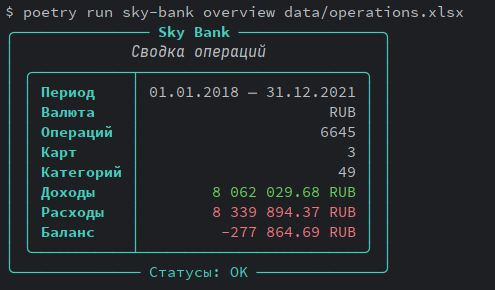
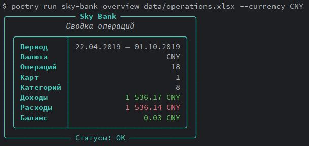
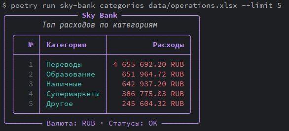
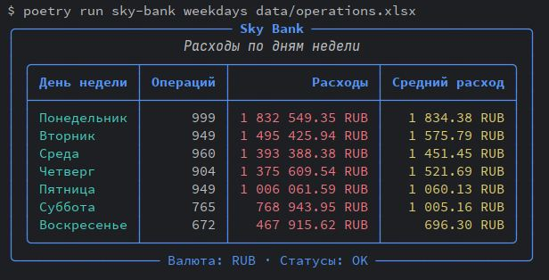
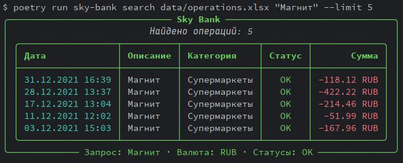
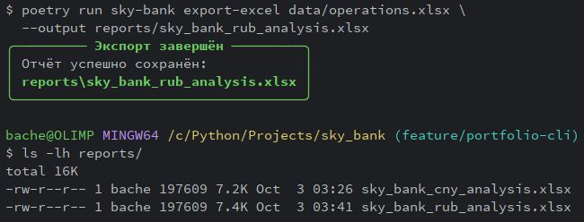

# Sky Bank CLI

Терминальное приложение для анализа банковских операций из Excel-выписки.

Sky Bank CLI читает банковские операции через `pandas`, фильтрует их по валюте и статусу, формирует сводную аналитику, показывает расходы по категориям и дням недели, а также позволяет искать операции по описанию.

Проект создан на Python с использованием `Typer`, `Rich`, `pandas`, `openpyxl`, `requests`, `pytest` и Poetry.

---

## Возможности

- Чтение банковской выписки из Excel (`.xlsx`)
- Общая сводка операций
- Раздельный анализ RUB и CNY
- Исключение неуспешных операций (`FAILED`) по умолчанию
- Отчёт по крупнейшим категориям расходов
- Анализ расходов по дням недели
- Поиск операций по описанию
- Фильтрация результатов по категории, валюте, статусу и количеству строк
- Красивый терминальный интерфейс через Rich
- Экспорт аналитических данных в Excel
- Получение официальных курсов валют Банка России
- Unit- и CLI-тесты через pytest и `CliRunner`

---

## Технологии

| Инструмент | Назначение |
|---|---|
| Python 3.11+ | Основной язык проекта |
| Poetry | Управление зависимостями и виртуальным окружением |
| pandas | Чтение, обработка и агрегация Excel-данных |
| openpyxl | Формирование и оформление Excel-отчётов |
| Typer | Создание CLI-команд |
| Rich | Таблицы, панели, цветной вывод и ошибки в терминале |
| requests | HTTP-запросы к внешним API |
| apimoex | Получение данных Московской биржи |
| cbrapi | Получение валютных данных ЦБ РФ |
| pytest | Автоматическое тестирование |
| pytest-cov | Анализ покрытия тестами |
| mypy | Проверка типов |
| black / isort / flake8 | Форматирование и статический анализ кода |

---

## Требования

- Python `>=3.11,<4.0.0`
- Poetry
- Git

Ограничение Python связано с совместимостью используемых зависимостей, включая `cbrapi`.

---

## Установка

### 1. Клонировать репозиторий

```bash
git clone https://github.com/Alex-399745146/sky_bank.git
cd sky_bank
```

### 2. Установить зависимости

```bash
poetry install
```

### 3. Проверить CLI

```bash
poetry run sky-bank --help
```

---

## Формат Excel-выписки

Для работы CLI Excel-файл должен содержать следующие столбцы:

| Столбец | Назначение |
|---|---|
| `Дата операции` | Дата и время банковской операции |
| `Номер карты` | Последние цифры или маска номера карты |
| `Статус` | Статус операции, например `OK` или `FAILED` |
| `Сумма платежа` | Сумма операции: расход — отрицательное число, доход — положительное |
| `Валюта платежа` | Валюта операции, например `RUB` или `CNY` |
| `Категория` | Категория операции |
| `Описание` | Текстовое описание операции |

Пример строки:

| Дата операции | Номер карты | Статус | Сумма платежа | Валюта платежа | Категория | Описание |
|---|---|---|---:|---|---|---|
| `31.12.2021 16:39:04` | `*7197` | `OK` | `-118.12` | `RUB` | `Супермаркеты` | `Магнит` |

---

## Использование CLI

Все команды запускаются через Poetry:

```bash
poetry run sky-bank <команда>
```

### Справка

```bash
poetry run sky-bank --help
```

<div align="center">
  
</div>

### Версия приложения

```bash
poetry run sky-bank version
```

### Курсы валют Банка России

```bash
poetry run sky-bank rates
```

Команда показывает официальные курсы иностранных валют к рублю по данным Банка России.

> **Важно:** курсы валют используются только как справочная информация.
> Они не конвертируют исторические операции и не являются инвестиционной рекомендацией.

По умолчанию отображаются курсы:

```text
USD
EUR
CNY
```

Можно запросить конкретные валюты:

```bash
poetry run sky-bank rates CNY USD
```

<div align="center">
  
</div>

Вывод включает:

- код валюты;
- название валюты;
- курс за одну единицу валюты в рублях;
- дату публикации курса Банком России.

Если валюта отсутствует в ответе Банка России, команда завершается с понятной ошибкой.

### Общая сводка операций

```bash
poetry run sky-bank overview data/operations.xlsx
```

<div align="center">
  
</div>

Команда показывает:

- период операций;
- валюту;
- количество операций;
- число карт и категорий;
- доходы;
- расходы;
- итоговый баланс.

По умолчанию учитываются только успешные операции со статусом `OK` в валюте `RUB`.

Использование другой валюты:

```bash
poetry run sky-bank overview data/operations.xlsx --currency CNY
```

<div align="center">
  
</div>

Учёт неуспешных операций:

```bash
poetry run sky-bank overview data/operations.xlsx --include-failed
```

### Расходы по категориям

```bash
poetry run sky-bank categories data/operations.xlsx
```

Показать только пять крупнейших категорий:

```bash
poetry run sky-bank categories data/operations.xlsx --limit 5
```

<div align="center">
  
</div>

Отчёт по операциям CNY:

```bash
poetry run sky-bank categories data/operations.xlsx --currency CNY
```

Учесть операции со статусом `FAILED`:

```bash
poetry run sky-bank categories data/operations.xlsx --include-failed
```

### Расходы по дням недели

```bash
poetry run sky-bank weekdays data/operations.xlsx
```

<div align="center">
  
</div>

Отчёт показывает:

- день недели;
- количество расходных операций;
- общую сумму расходов;
- средний расход на одну операцию.

Пример с включением `FAILED`-операций:

```bash
poetry run sky-bank weekdays data/operations.xlsx --include-failed
```

### Поиск операций

Поиск операций по описанию:

```bash
poetry run sky-bank search data/operations.xlsx "Магнит"
```

Ограничить число результатов:

```bash
poetry run sky-bank search data/operations.xlsx "Магнит" --limit 5
```

<div align="center">
  
</div>

Дополнительно отфильтровать по категории:

```bash
poetry run sky-bank search data/operations.xlsx \
  "Магнит" \
  --category "Супермаркеты"
```

Искать по операциям CNY:

```bash
poetry run sky-bank search data/operations.xlsx "перевод" --currency CNY
```

Если совпадения отсутствуют, приложение выводит понятное сообщение в терминале, а не traceback.

---

## Логика фильтрации

Во всех аналитических командах используются единые правила:

| Правило | Значение по умолчанию |
|---|---|
| Валюта | `RUB` |
| Статус операций | Только `OK` |
| Расход | `Сумма платежа < 0` |
| Доход | `Сумма платежа > 0` |
| Валюта для отчётов | Передаётся через `--currency` |
| Неуспешные операции | Добавляются только через `--include-failed` |

Разделение валют важно: суммы RUB и CNY не смешиваются в одной аналитической сводке.

---

## Excel-экспорт

Проект содержит отдельный модуль экспорта:

```bash
poetry run sky-bank export-excel data/operations.xlsx \
  --output reports/sky_bank_rub_analysis.xlsx
```

<div align="center">
  
</div>


Он формирует Excel-файл с тремя листами:

```text
Сводка
Категории
Дни недели
```

В отчёте используются:

- цветные заголовки;
- автоматические фильтры;
- закреплённая строка заголовков;
- автоматическая ширина колонок;
- числовое форматирование денежных сумм.

Папка `reports/` исключена из Git, поскольку содержит локально сгенерированные результаты работы программы.

---

## Архитектура проекта

```text
sky_bank/
├── data/
│   └── operations.xlsx
│
├── reports/
│   └── *.xlsx
│
├── src/
│   ├── sky_bank/
│   │   ├── __init__.py
│   │   ├── analytics.py
│   │   ├── cli.py
│   │   └── exporters.py
│   │
│   ├── main_page/
│   ├── reports_page/
│   ├── services_page/
│   └── data_extract.py
│
├── tests/
│   ├── conftest.py
│   ├── test_analytics.py
│   ├── test_cli.py
│   ├── test_exporters.py
│   └── ...
│
├── .gitignore
├── pyproject.toml
├── poetry.lock
└── README.md
```

### Разделение ответственности

| Модуль | Ответственность |
|---|---|
| `analytics.py` | Бизнес-логика: сводка, категории, поиск, дни недели |
| `cli.py` | Typer-команды, входные параметры, Rich-вывод и обработка ошибок |
| `exporters.py` | Формирование и оформление Excel-отчётов |
| `tests/` | Unit-тесты, тесты CLI и тесты Excel-экспорта |

---

## Тестирование

Запустить все тесты:

```bash
poetry run pytest -q
```

Запустить тесты с покрытием:

```bash
poetry run pytest --cov=src --cov-report=term-missing
```

В проекте тестируются:

- расчёт сводки;
- фильтрация операций по валюте и статусу;
- категории расходов;
- расходы по дням недели;
- поиск;
- создание Excel-файла;
- CLI-команды через `typer.testing.CliRunner`.

---

## Проверки качества

### Форматирование Black

```bash
poetry run black --check src tests
```

### Сортировка импортов isort

```bash
poetry run isort --check-only src tests
```

### Линтер flake8

```bash
poetry run flake8 src tests
```

### Проверка типов MyPy

```bash
poetry run mypy src
```

---